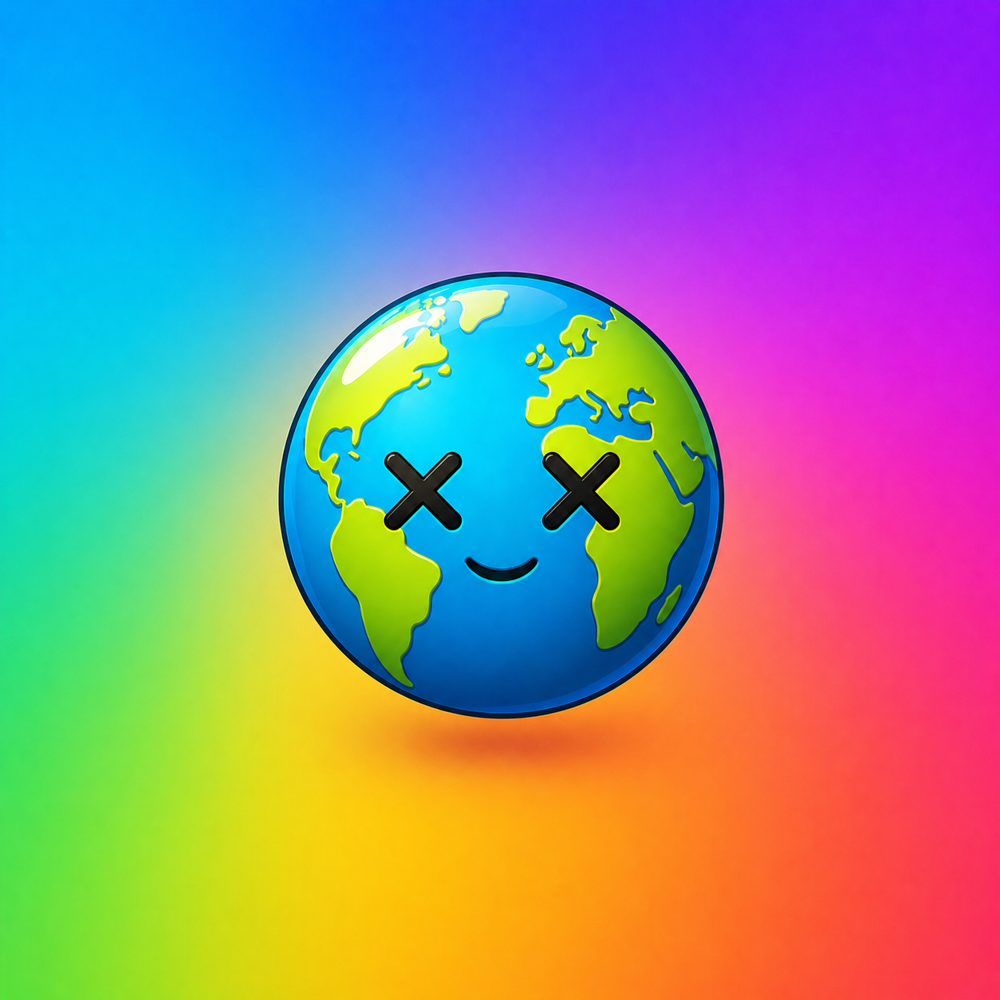
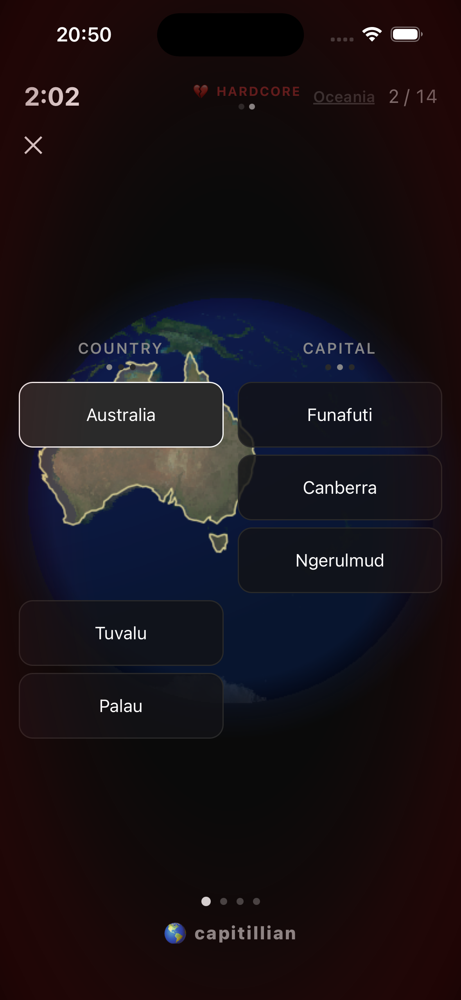
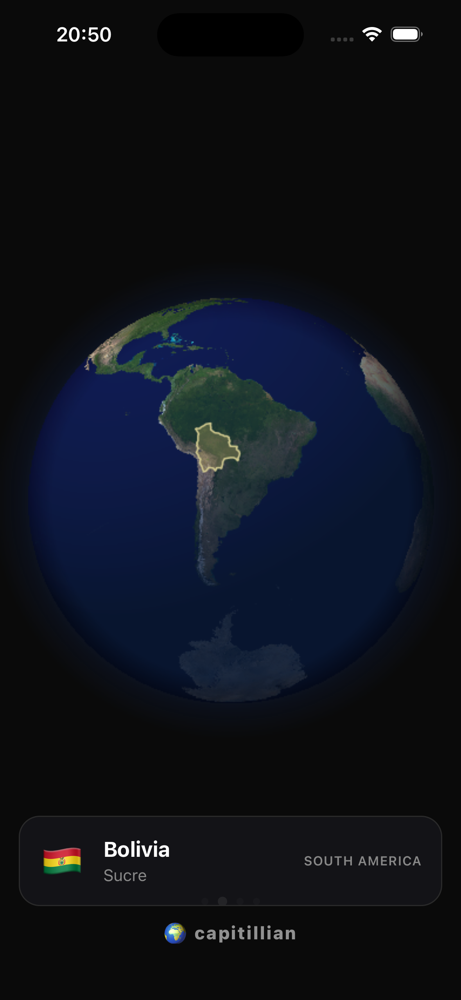
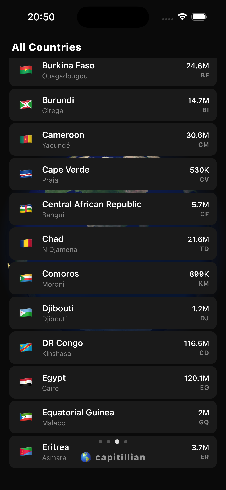
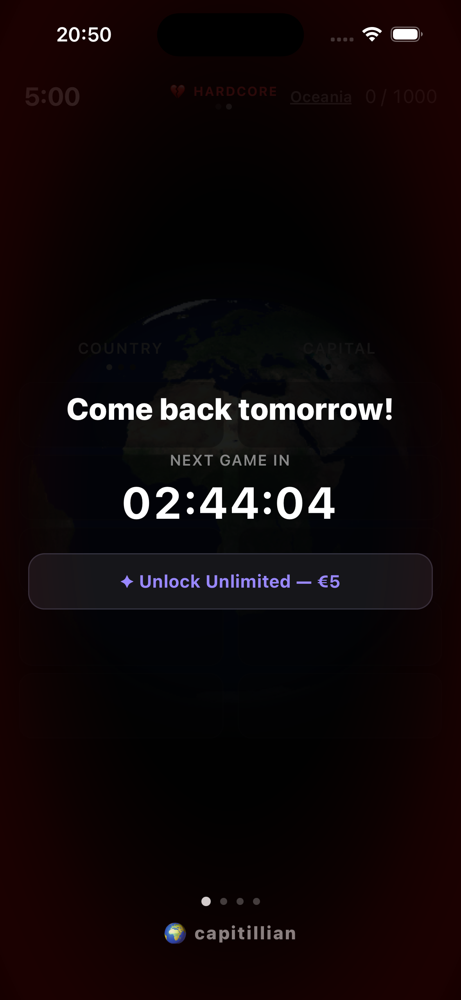
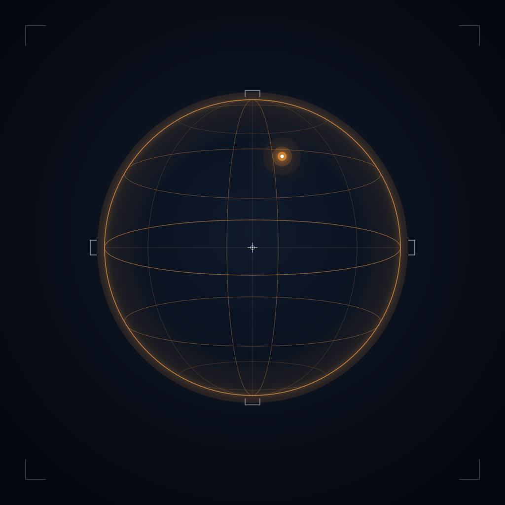
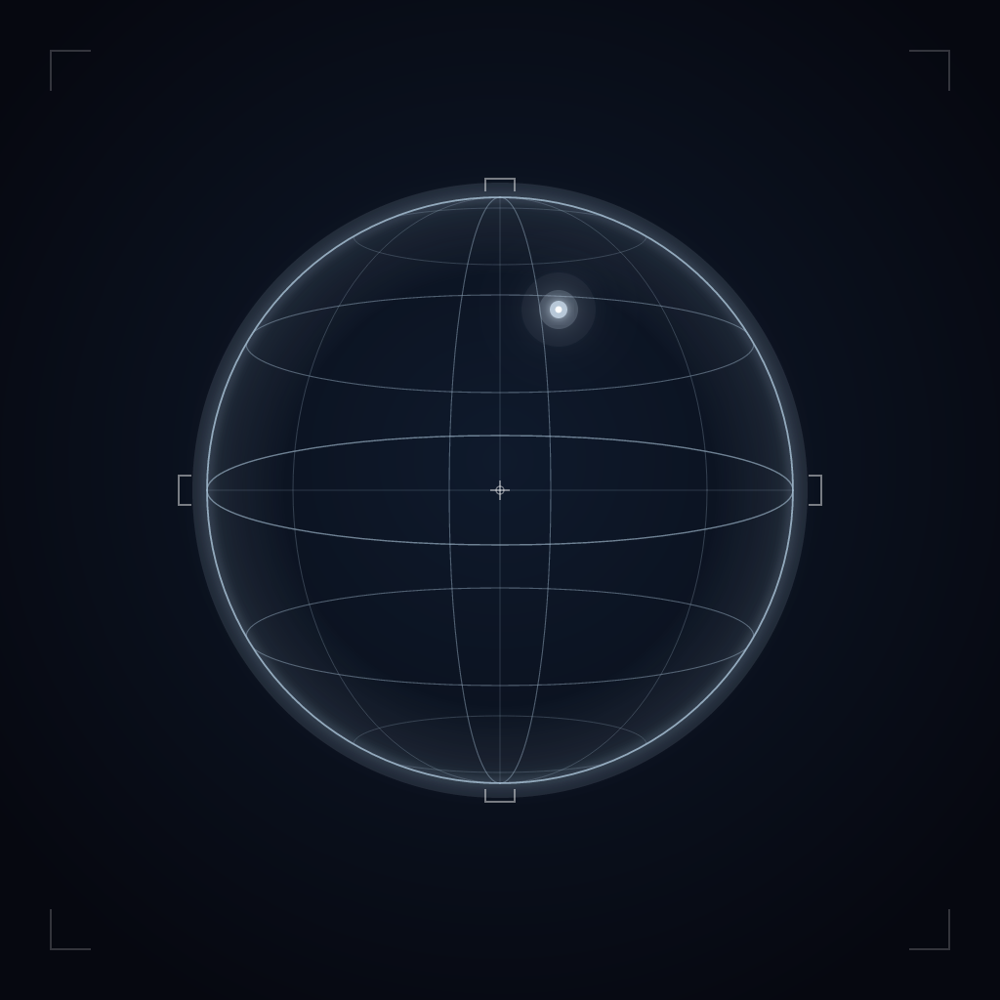
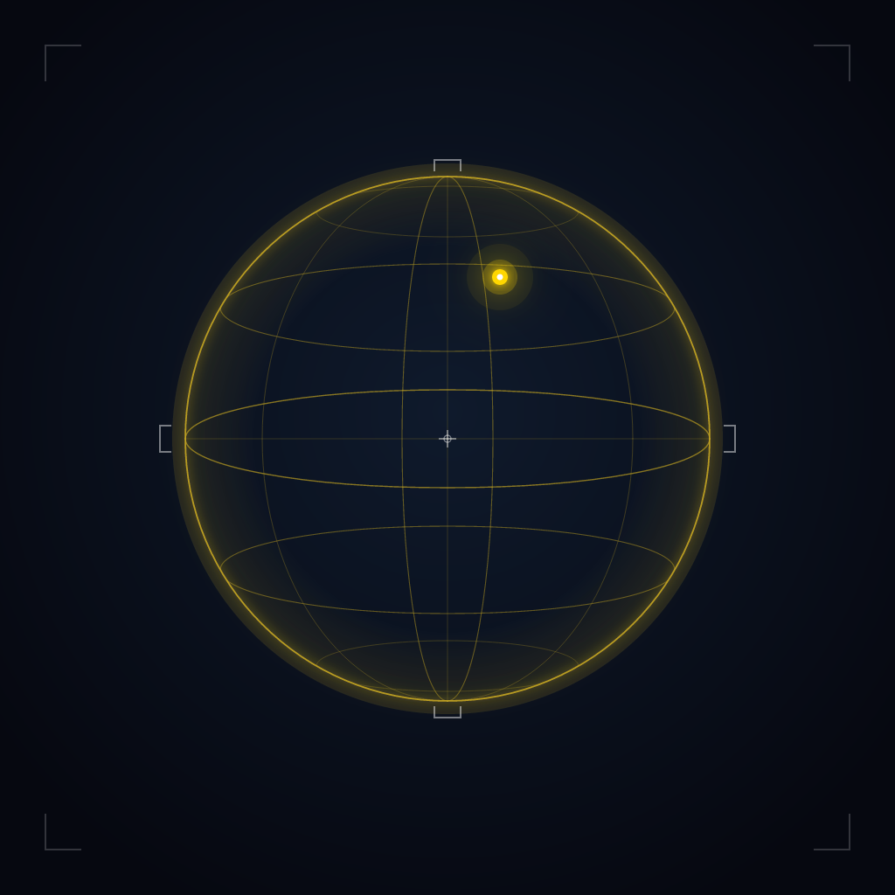
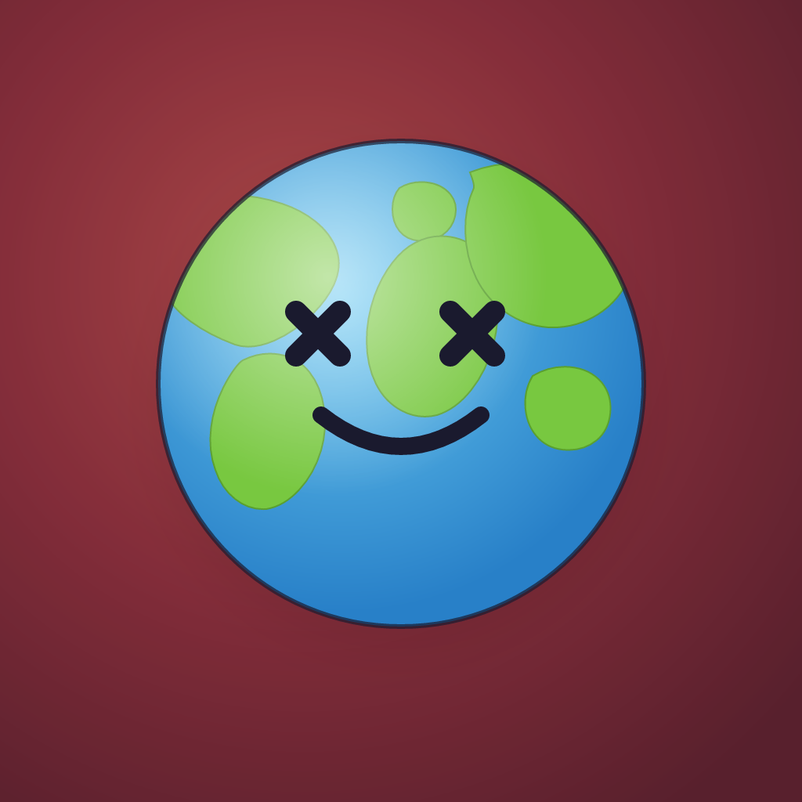
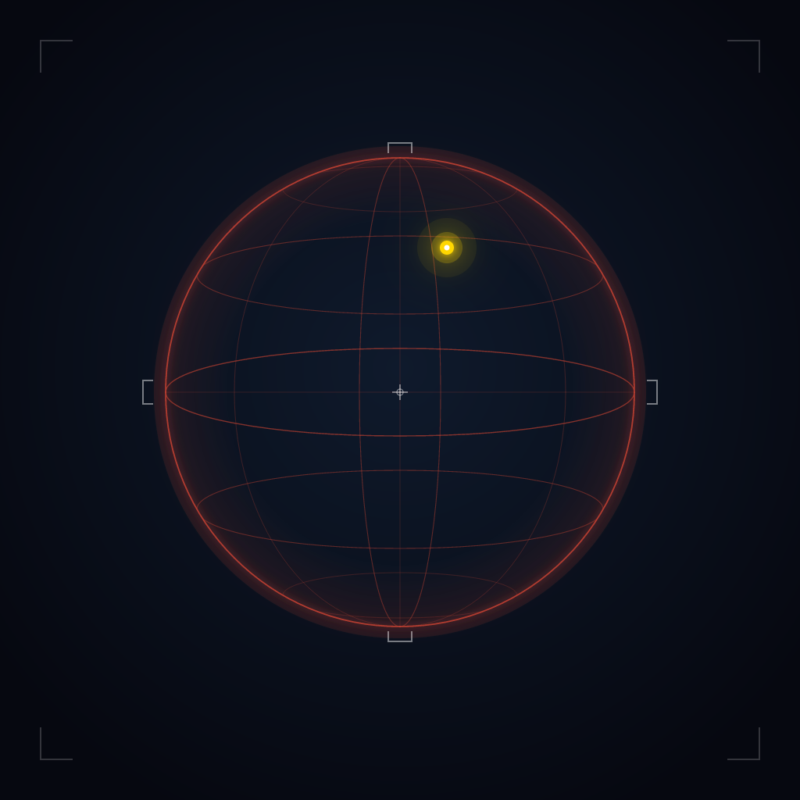

<p align="center">
  
</p>

<h1 align="center">Capitillian</h1>

<p align="center">
  Match countries to capitals, flags, and populations.<br/>
  Spinning globe. Mine mode. Streak badges.
</p>

<p align="center">
  
  
  
  
</p>

---

## Screens

<p align="center">
  
  
  
  
</p>

## How it plays

Five cards on the left, five on the right. Tap one card, then tap its
match on the other side. Correct pairs vanish and refill from the pool
of 197 countries. Five minutes, fifty pairs, no lives lost on a wrong
guess — just shame.

### Modes

| Mode             | Left   | Right    | Tier    |
|------------------|--------|----------|---------|
| Names → Capitals | name   | capital  | Free    |
| Flags → Names    | flag   | name     | Free    |
| Flags → Capitals | flag   | capital  | Free    |
| Mine             | any    | any      | Premium |
| All Countries    | any    | any      | Premium |

**Mine** mode: one wrong answer and the run ends. **All Countries**
mode: every nation on Earth in a single sitting — the marathon for
serious learners.

### Free vs Premium

| Feature                   | Free | Premium    |
|---------------------------|------|------------|
| Games per day             | 1    | Unlimited  |
| All Countries (197) mode  | —    | yes        |
| Mine mode                 | —    | yes        |
| Cross-device streak sync  | —    | yes        |
| Earned app icons          | yes  | yes        |

## Streaks & icons

A streak is consecutive calendar days with at least one **completed**
game. There are two independent streaks — Match and Mine — each
rewarding bronze, silver, and gold badges that unlock as alternate
app icons.

<p align="center">
  
  
  
  &nbsp;&nbsp;&nbsp;&nbsp;
  
  
  
</p>

| Days  | Match icon   | Mine icon   |
|-------|--------------|-------------|
| 7     | Bronze Globe | Bronze Mine |
| 30    | Silver Globe | Silver Mine |
| 100   | Gold Globe   | Gold Mine   |

Streaks cap at 100. Once an icon is unlocked, it's yours to keep —
breaking the streak doesn't take it back.

## Stack

- **React Native** (Expo SDK 54, new architecture enabled)
- **Canvas globe** rendered in a WebView from TopoJSON
- **RevenueCat** for in-app purchases and entitlements
- **Sentry** for crash reporting
- **Supabase** for premium streak sync
- **Jest** + **@testing-library/react-native** for unit tests

## Run

```bash
npm install --legacy-peer-deps
npm start          # Expo dev server
npm test           # Jest
npm run ios        # Build & run on a connected device
```

## Build

Cloud build via EAS:

```bash
eas build --platform ios --profile production --auto-submit
```

Or locally via Xcode:

```bash
npx expo prebuild --platform ios --clean
cd ios && pod install && cd ..
open ios/Capitillian.xcworkspace
# Product → Archive → Distribute App → App Store Connect
```

## Versioning

Conventional commits drive [semantic-release](https://semantic-release.gitbook.io/)
on every push to `main`:

| Commit prefix                      | Release          |
|------------------------------------|------------------|
| `feat:`                            | minor bump       |
| `fix:` / `perf:` / `refactor:`     | patch bump       |
| `chore:` / `docs:` / `style:` / `test:` | no release  |
| `BREAKING CHANGE:` in body         | major bump       |

The CI release job rewrites `package.json`, `app.json`, and
`CHANGELOG.md` so the Expo manifest stays in lockstep with the npm
version and the git tag.
